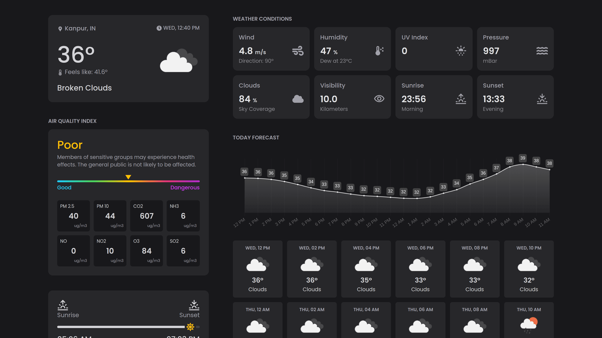

# 🌦️ Weather Forecast App

A responsive weather web app that lets users view current conditions, multi-day forecasts, and air quality using the OpenWeather API. Built with modern tools for performance and developer productivity.

---

## 🚀 Features

- 🌡️ Real-time weather by city
- 📆 5-day forecast with min/max temps
- 🌬️ Wind speed and weather description
- 🌫️ Air quality index (AQI)
- 🕘 Search history with reselect and remove
- 📱 Fully responsive (mobile + desktop)

---

## 🧱 Tech Stack

- **Next.js** + **TypeScript**
- **Tailwind CSS** — styling
- **Axios** — API requests
- **OpenWeather API** — weather data

---

## 📸 Screenshot



---

## ⚙️ Getting Started

### 1. Clone the Repo
```bash
git clone https://github.com/rost-biletskyy/weather-forecast-app.git
cd weather-forecast-app

```

## Install Dependencies
npm install

## Configure Environment
Create a .env.local file
NEXT_PUBLIC_OPENWEATHER_API_KEY=your_openweather_api_key

## Run the App
npm run dev

Visit http://localhost:3000
